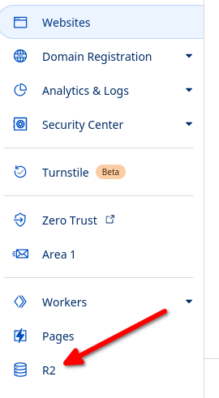
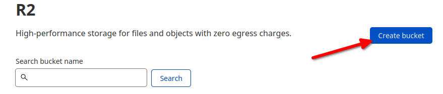
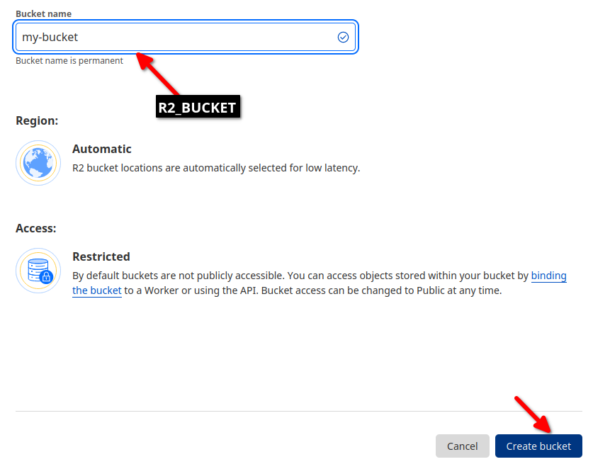
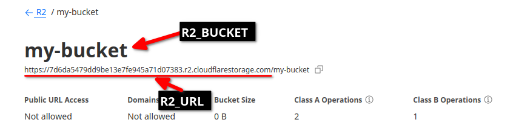
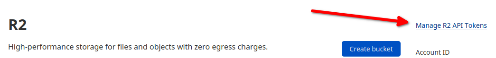
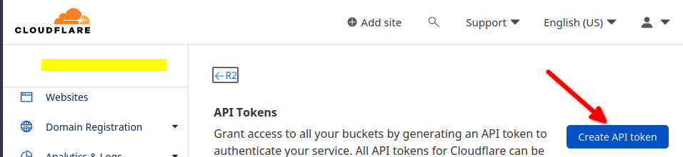
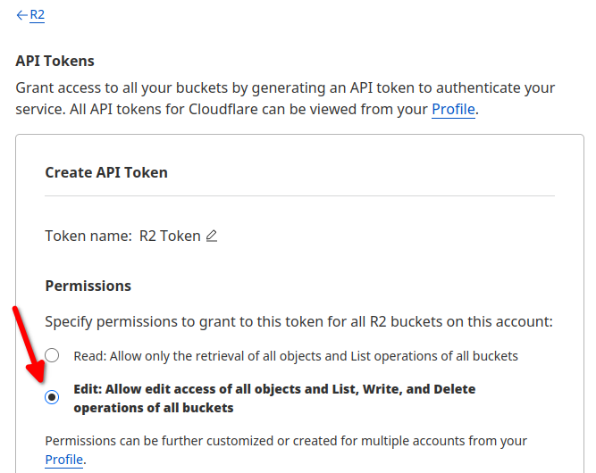
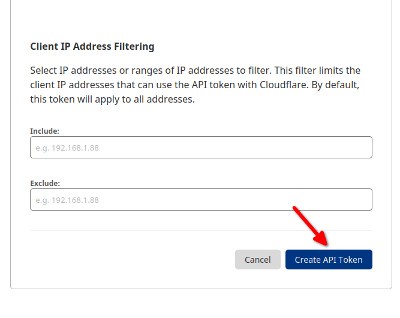
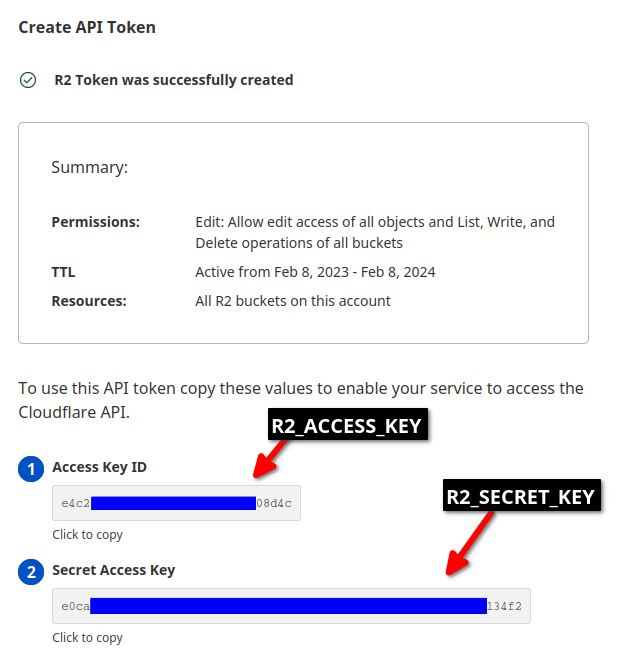

# A template for Pocketbase with Cloudflare R2 Backup Streaming with Vue Front end 

This template pulls from the following projects, please send them love:
- Pocketbase backend R2 backup base: https://github.com/aleda145/pocketbase-lab
- Pocketbase front end Vue base: https://github.com/StefanVDWeide/pocketbase-vue
- Pocketbase compose file: https://github.com/muchobien/pocketbase-docker

## What's inside

From these requirements, this template uses:
- [Pocketbase](https://github.com/pocketbase/pocketbase) as a back end
  - Uses SQLite - Blazingly fast, easy to back up and restore as it's justa  file
  - All in one back end (Auth, Data, Live Updates)
- [Litestream](https://github.com/benbjohnson/litestream) for backup streaming and easy restoring
  - Streams changes to database near instantly to R2 (or other destination if needed. But that's on you)
  - Facilitates automatic restoring on new container creation and easy restoring on existing container via a point-in-time
- [Vue](https://github.com/vuejs/vue) for frontend because it's more fun that react - hosted by Github pages, Cloudflare Pages or whichever static host you prefer


## Notes

**ONLY ONE INSTANCE SHOULD BE BACKING UP TO AN R2 BUCKET AT A SINGLE TIME. LITESTREAM AND POCKETBASE ARE A SINGLE PROCESS APPLICATION. THIS IS NOT DISTRIBUTED COMPUTING**

Pocketbase reserves the right to break anything in this repo, so there will be some manual steps to allow for this repo to be as generic as possible.
By default, it will grab the newest version of pocketbase, but it can be limited by providing an variable X
I have kept the go extended version of Pocketbase (and not the binary) to allow for custom functions out-of-the-box


# Stop talking, How do I actually install this thing

## Set up R2 and SecretKeys on Cloudflare


| **Creating R2 bucket**                                                                                         |                                             |
|----------------------------------------------------------------------------------------------------------------|---------------------------------------------|
| On Cloudflare, click R2 on the left pane                                                                       |            |
| Click 'Create Bucket'                                                                                          |        |
| Type in the name for the bucket. This name will be used later                                                  |   |
| The following screen will show the values for R2_BUCKET and R2_URL. Note that R2_URL excludes the bucket name. |       |

| **Creating API Token and secret**                                                                              |                                             |
|----------------------------------------------------------------------------------------------------------------|---------------------------------------------|
| Now create the access keys. Click 'Manage API Tokens'                                                          |        |
| Click 'Create API Token'                                                                                       |  |
| Set the permissions to 'Edit'                                                                                  |  |
| You can set an expirty if you wish. Either way, click 'Create API token'                                       |         |
| Note these secret keys. BE SURE NOT TO UPLOAD THESE TO GITHUB!                                                 |                 |


## Set up Pocketbase backend for local dev

Clone this template in Github and pull locally

1. Copy the environment variables template
 ``` cd backend && cp .env.template .env```
2. Replace placeholder text in ```.env``` with values from Cloudflare we got beabove
3. Run `docker compose up -d` to bring Pocketbase up with backup streaming enabled
4. Run ```./apply_migrations.sh``` to generate the 'post' collection to allow the example front end to work. 
5. Access Pocketbase via http://0.0.0.0:8090/_/
6. Yes, that's it


## Front end
```
npm install
npm run start
```

Open http://localhost:3000/ and create an account
- Make sure a valid email is used (1@a.com and such don't work)
- Check the network tab for errors as the basic setup here doesn't show error

You are now running a Pocketbase/React setup


# Deploying to production
If you have your own server, just brind up the docker container on a server, and your Pocketbase database will automatically grab current data.

If you don't want  aserver, you coul dget a service like fly.io to host your code.


# Migrating to new version of pocketbase
Check notes 
Modify database as required
```docker-compose down && docker-compose up --build ```

e-


<br/><br/><br/><br/><br/><br/><br/><br/><br/><br/>
<br/><br/><br/><br/><br/><br/><br/><br/><br/><br/>

---
# Original Pocketbase lab Notes

This is my repository for playing around with pocketbase and a react SPA as the frontend.

It also uses https://litestream.io/ to replicate the sqlite databases to Cloudflare R2.

Pocketbase is hosted on fly.io and the React app is hosted on Cloudflare Pages

Check it out at https://pocketbase-lab.pages.dev/

I am not very good at React, and just picked up last month. So if you think I'm doing
weird stuff and doing things "the React way", I would really appreciate feedback! Just raise in issue!

## Deploying yourself 

### Frontend

If you want to try this out for yourself all the code I use is here.

For react follow this guide: https://developers.cloudflare.com/pages/framework-guides/deploy-a-react-application/

You need to set the build root directory to /frontend for it properly build the react app.

You need to set some environment variables in the settings after deploying it on cloudflare pages:

```
NODE_VERSION=16
REACT_APP_API_URL=https://pocketbase-alex.fly.dev/
```

### Backend

Deploying on fly.io is simple. Follow their guide

https://fly.io/docs/getting-started/dockerfile/

I am including my own fly.toml file here, but you would need to change the appname or generate one yourself :)

I am using a bucket on Cloudflare R2, which you can read about and sign up for here:

https://www.cloudflare.com/products/r2/

You need to set some environment variables for the litestream replication.

They are:

```
R2_BUCKET
R2_ACCESS_KEY
R2_SECRET_KEY
R2_DATA_PATH
R2_LOGS_PATH
R2_URL
```

Put them in a secrets.env file and run `fly secrets import < secrets.env` to set all of them at the same time.

## Help!

Feel free to create an issue if you need help! I can't promise fast response times though.
